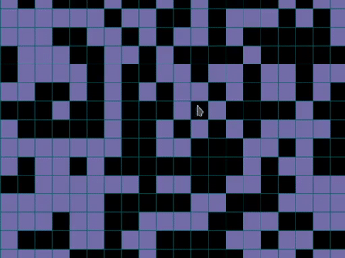

# cellular-automata

A place to mess around with cellular automata


## Table of Contents
* **[Installation](#installation)**
* **[Quickstart](#quickstart)**

## Installation

1. Clone this repository
    ``` sh
    git clone https://github.com/3starblaze/cellular-automata.git
    cd cellular-automata/
    ```

2. Create and activate venv
   ```sh
   python3 -m venv .venv
   source .venv/bin/activate
   ```

3. Install requirements

    ``` sh
    pip install -r requirements.txt
    ```

4. [OPTIONAL] Install developer requirements

    ``` sh
    pip install -r dev-requirements.txt
    ```

5. You're done!

## Quickstart

Starting your project is easy.

1. Create a file

    We're going to call it `example.py`

2. Import main libraries

    ```python
    from StateMaintainer import StateMaintainer
    from GridDrawer import GridDrawer
    from Controller import Controller
    ```

3. Prepare data and ruleset

    1. Data
    
        For this example we're going to make a 20x20 grid with random values.

        ```python
        import numpy as np
        import random

        my_list = np.array([random.choice([1, 0]) for i in range(20**2)]).reshape(20, 20)
        ```

    2. Ruleset

        And for this one, we will implement Conway's Game of Life.
        First we'll need to select indices to retrieve. It uses coordinates relative 
        to the selected cell. For the Game of Life we will need to check adjacent
        tiles.

        ```python
        indices = [
           (-1, 1),  (0, 1),  (1, 1),
           (-1, 0),           (1, 0),
           (-1, -1), (0, -1), (1, -1)
        ]
        ```

        Then we're going to make a function, it takes `cell` which is the current
        state of selected cell and `values` which is an array of requested cells by
        indices array. Since `True` turns to `1` and `False` to `0`, it's easy to
        just sum these values together.

        ```python
        def GAME_OF_LIFE_RULESET(cell, values):
            if cell:
                return sum(values) >= 2 and sum(values) <= 3
            else:
                return sum(values) == 3
        ```

        Now we can make our `StateMaintainer`.
        ``` python
        MyState = StateMaintainer(my_list, {"indices": indices, "ruleset": GAME_OF_LIFE_RULESET})
        ```
4. Stick together all this data

    And right before seeing cellular automation in action, we have to configure it a
    bit. `GridDrawer` is responsible for drawing... grids. It takes line width,
    spacing and data (also grid line and cell color).

    ``` python
    MyDrawer = GridDrawer(1, 30, MyState.data)
    ```

    And finally we pass MyState and MyDrawer to the Controller.

    ``` python
    Controller(MyState, MyDrawer).run()
    ```
5. Launch it!

    Great! We're done writing and now it's time to observe!

    ```sh
    python3 example.py
    ```
    

    Now there's a bunch of colored (and uncolored) squares. Colored ones represent alive cells, uncolored - dead cells.

    To advance your simulation, press right arrow ➡️!
    

    Keep in mind that just because you don't see some cells, doesn't mean they don't exist. Observe the right side. There's             an empty column and this column won't be updated. There are also few invisible cells that go up. These instructions are also put together in [example.py](src/example.py). It's a bit more verbose but does the same thing.


    And that's about it. I know that's not much, but it's something. New features will await.

